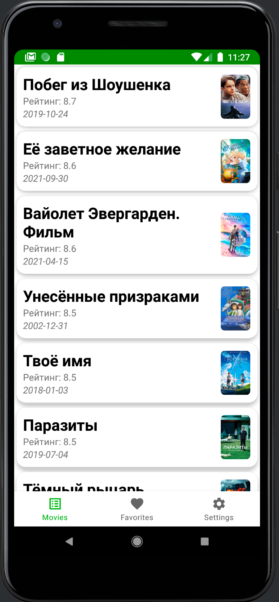
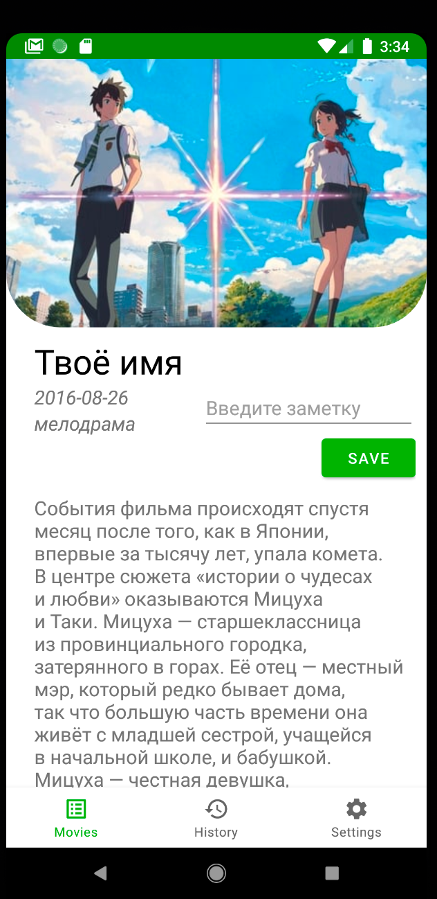
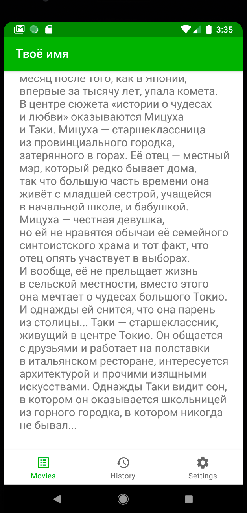
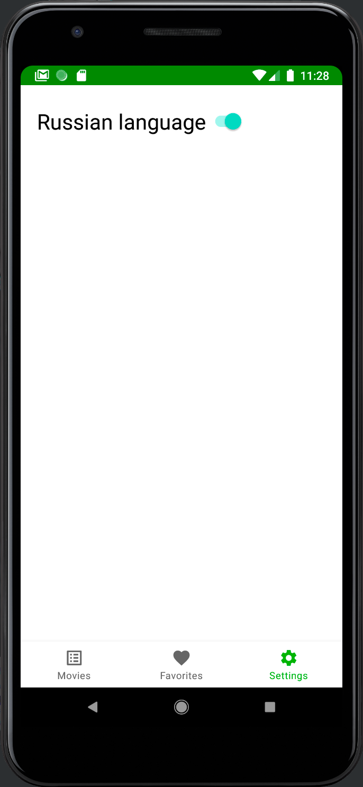

Movie Search app
=================

Для успешного соединения с api нужно подключить `VPN` 
Последние актуальные изменения находятся в ветке `develop`

Pet project для демонстрации технологий и подходов в android разработке, которые я изучаю на данный момент
Основное назначение: отображать список фильмов с самым высоким рейтингом с сервиса themoviedb.org с возможностью перейти на страницу фильма и посмотреть более детальную информацию о нем. Также можно оставить заметку по каждому фильму, которая будет сохранена в локальную БД.
На странице настроек можно переключать язык отображения списка фильмов `en/ru` 

Также в приложении представлена второстепенная функциональность: 
- экран со списком контактов из телефонной книги (работа с разрешениями в андроид)
- экран с историей открытых фильмов (работа с локальной БД)
- экран с google картой (работа с api карт, использование компонентов service и broadcast receiver)
- возможность получения и кастомной обработки нотификаций отправленных из Firebase

Скриншоты:
----------

Список использованных технологий:
--------------------------------

- MVVM
- Recycler View
- Retrofit
- Room
- Canvas
- Shared Preferences
- Google map api
- Permissions
- Firebase-messaging
