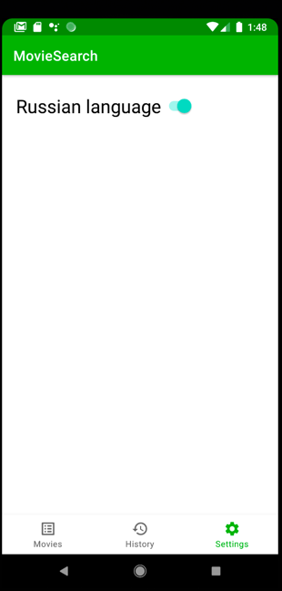

Movie Search app
=================

Для успешного соединения с api нужно подключить `VPN` 

Последние актуальные изменения находятся в ветке `develop`

Pet project для демонстрации технологий и подходов в android разработке, которые я изучаю на данный момент.

Основное назначение: отображать список фильмов (использовал `Recycler View`) с самым высоким рейтингом с сервиса themoviedb.org с возможностью перейти на детальную страницу (использовал `CollapsingToolbarLayout` для для визуального эффекта скрывания картинки фильма). Также можно оставить заметку по каждому фильму, которая будет сохранена в локальную БД (использование `Room`).
На странице настроек можно переключать язык отображения списка фильмов `en/ru` (сохранение состояния через `Shared Preferences`)

В качестве архитектуры выбрана `MVVM` с использованием `liveData`. Внедрение зависимостей реализовано с помощью `Dagger`. Запросы к api и локальной БД с помощью `Coroutines`.

Также в приложении представлена второстепенная функциональность: 
- экран с историей открытых фильмов (работа с локальной БД c помощью `Room`)
- возможность получения и кастомной обработки нотификаций отправленных из `Firebase`

Screenshots:
----------

! 
! 
! 
! 

Использованные технологии:
--------------------------------

- MVVM
- LiveData
- Dagger
- Coroutines
- Retrofit
- Room
- Broadcast Receiver
- Recycler View
- Canvas
- CollapsingToolbarLayout
- Shared Preferences
- Firebase-messaging
